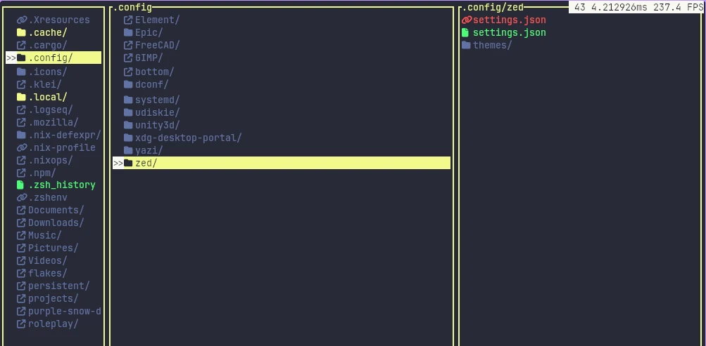

# Impermanence Watch
When using setups like [impermanence](https://github.com/nix-community/impermanence) on a nixos desktop, it's helpful to get a feeling about which files will get
deleted upon a reboot, so that you you can then decide to handle them as
temporary files anyways, or mount them to a persistent location.

Impermanence-Watch is a cli-tool, that basically shows a diff of two directories, with a focus on the use case for comparing impermanent machines.

* Greys out directories that are mountpoints to some other location
* Greys out directories that contain no changes
* Greys out symlinks that point into the nix store and only the hash has changed (useful for ignoring generation changes in home-manager symlinks)
* Show differences in directory content, file type, last modified time, symlink destination, etc.

## Setup

This tool was designed with the following setup in mind:
- Your root directory is made impermanent, by using a btrfs partition, and, on every boot, creating a new subvolume that will be mounted to the root. (and moving the previous root subvolume to an archive, which might then be mounted into `/old_roots` or somewhere)
- After the system has booted up (and nixos/home-manager has set up all the directories and symlinks), you create btrfs snapshot of your machine, and put that into e.g `/impermanence/current_root_on_boot`
- Then you can run `impermanence-watch -i /impermanence/current_root_on_boot /`, to get all the changes that happened to the file-system since the boot.
- Using the nixos impermanence module, you can then mount files that you want to keep persistent to a persistent subvolume, that doesn't get reset, and files that
you really don't care about to e.g a tmpfs

# Contributing

This tool was created for me by me, and i do not really expect anyone else to use it.
However if you do, feel free to open issues, submit pull requests, or the like.
Just be kind.
